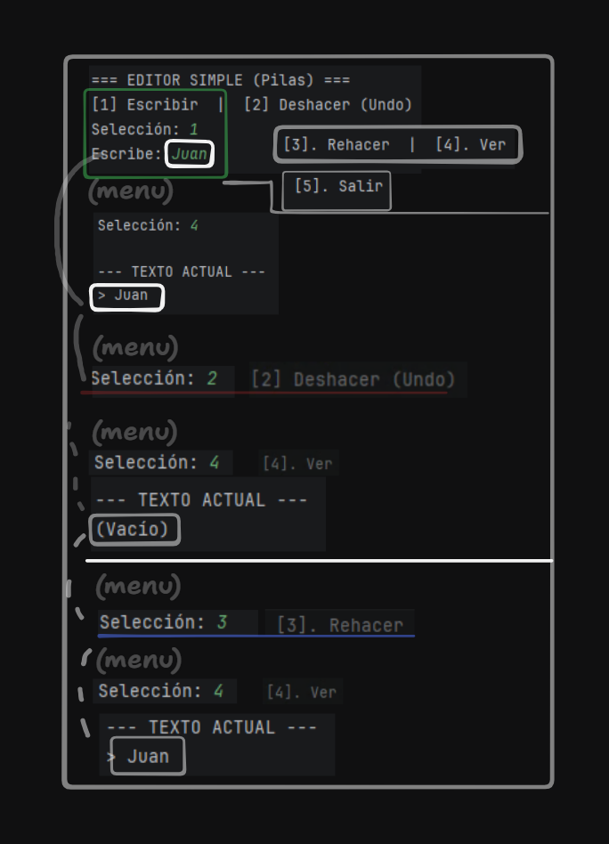

# ( EA1.2) Actividad - Simulador Undo/Redo con Pilas (Stacks)

### 📖 Fundamentación Teórica (Unidad 2)
Según el material de estudio de la Unidad 2, una **Pila** es una lista que permite almacenar y recuperar datos bajo el principio **LIFO** (*Last In First Out*), es decir, el último elemento en entrar es el primero en salir. 

En este proyecto, la estructura de la pila se implementó de forma manual utilizando un **arreglo de datos**, definiendo una capacidad fija para el almacenamiento de los elementos.

**Funcionamiento del Simulador:**
* **Operación Push (Apilar):** Se utiliza para adicionar un elemento al final de la pila principal cada vez que el usuario escribe texto. 

* **Operación Pop (Desapilar):** Se emplea para eliminar el último elemento de la pila principal (Undo) y trasladarlo a la pila secundaria (Redo). 

### 🚀 Instrucciones de Ejecución
1. Abra el proyecto en IntelliJ IDEA
2. Ejecute la clase `Main.java`.
3. Interactúe con el menú en consola para escribir, deshacer o rehacer acciones.

### 📸 Ejemplo de flujo en consola! 

### 👥 Contribuyentes 
* **Juan José Meneses Jaramillo**
* **Andrés David Angulo Galván**
* **Amy buitrago salazar**
* **Zaira daniela sepulveda montoya**
* **Juana Zapata**
